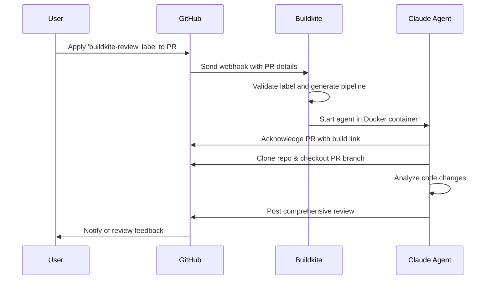

# Buildkite Agentic Pipeline Example: Code Review Bot

A [Buildkite](https://buildkite.com) pipeline that uses [Claude Code](https://docs.claude.com/en/docs/claude-code/overview) and Buildkite model providers to review GitHub pull requests.

## Setting up

### Step 1: Start with an existing GitHub repository

Make sure you have access to a GitHub repository that allows you to create pull requests and create and manage [webhooks](https://docs.github.com/en/webhooks).

### Step 2: Prepare your agentic pipeline

1. [Create a new GitHub repository](https://github.com/new?template_name=github-code-review-bot&template_owner=buildkite-agentic-examples) using this repository as a template.
1. [Create a new Buildkite pipeline](https://buildkite.com/organizations/~/pipelines/new) for your newly templated repository with a Linux [hosted agents](https://buildkite.com/docs/pipelines/hosted-agents) cluster.
1. [Create a new pipeline trigger](https://buildkite.com/~/buildkite-agentic-github-pr-review/settings/triggers/new?trigger_type=webhook) for the pipeline, then copy the generated webhook URL to your clipboard.
1. On the **Settings** > **Webhooks** page of the GitHub repository from Step 1, add a new webhook, paste your Buildkite webhook URL into the **Payload URL** field, choose **Select individual events**, choose **Pull requests**, and save.
1. Create two new [Buildkite secrets](https://buildkite.com/docs/pipelines/security/secrets/buildkite-secrets) with the following names:
   1. `GITHUB_TOKEN`: A GitHub [personal access token](https://docs.github.com/en/authentication/keeping-your-account-and-data-secure/managing-your-personal-access-tokens) with `repo` and `pull_request` read/write scopes.
   1. `API_TOKEN_BUILDKITE`: A Buildkite [API access token](https://buildkite.com/docs/apis/managing-api-tokens) with `read_builds`, `read_build_logs`, and `read_pipelines` permissions.

### Step 3: Request a code review

1. Create a new pull request on the GitHub repository from Step 1 with code you want reviewed. Apply the `buildkite-review` label to it. (This label is configurable in `.buildkite/pipeline.yml`.)
1. In a few moments, you should see a new comment appear on the PR confirming the agent's picked up the task. Follow the link to the Buildkite dashboard to have a look.
1. Once the agent completes its review, you should see comprehensive feedback posted as a comment on your PR with suggestions.

That's it! Your code's now been reviewed. :tada:

## Handling multiple repositories

A single agentic pipeline can handle builds originating from multiple GitHub repositories. Just create a new pipeline trigger and associated GitHub webhook for each one (as described in Step 2 above), and apply the `buildkite-review` label as needed.

## How it works

The pipeline listens for webhooks originating from GitHub pull-request events. When a labeled PR is detected, the pipeline runs the `handler` script, which adds a step to the running pipeline that uses Claude to review the code, [annotating](https://buildkite.com/docs/apis/rest-api/annotations) the Buildkite build as it goes. When the review is complete, Claude posts comprehensive feedback directly on the PR with specific suggestions for improvement.

The following diagram shows the high-level flow, beginning with the PR label:

### Step summary

1. User applies a `buildkite-review` label to a GitHub PR.
1. GitHub sends a webhook notification to Buildkite with PR details, triggering the pipeline.
1. Pipeline evaluates the webhook payload and conditionally adds a step to the running pipeline to launch Claude.
1. In a Docker container, Claude clones the repository, checks out the PR branch, and analyzes the code changes.
1. Claude reviews the code and posts comprehensive feedback with specific suggestions back to the GitHub PR.
